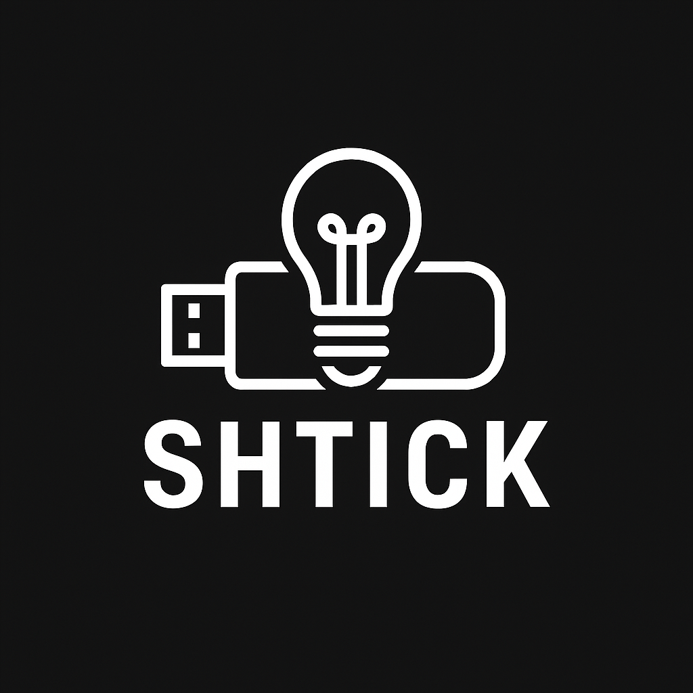

<p align="center">
    
</p>
# shtick

A college project to have offline llm's on a stick

(a usb flash drive).


## Acknowledgements

 - [llama.cpp](https://github.com/ggml-org/llama.cpp)
 - [Awesome README](https://github.com/matiassingers/awesome-readme)


## Authors

- [sameer](https://www.github.com/REXFEDEC)


## Badges

totally opensource


[](https://opensource.org/licenses/)


## Installation

just put the complete project on a usb and add your model in the models folder

preferrably with the name 'your-model'.gguf

```bash
from there on out, it's just a matter of runnning the .sh script if you're on linux and running the batch file if you're on windows
```
    
## Lessons Learned

well, mostly just how cool ai is without a rate limiter and active censoring.

also this allowed me to have an assistant in my college systems where the network sucks.

